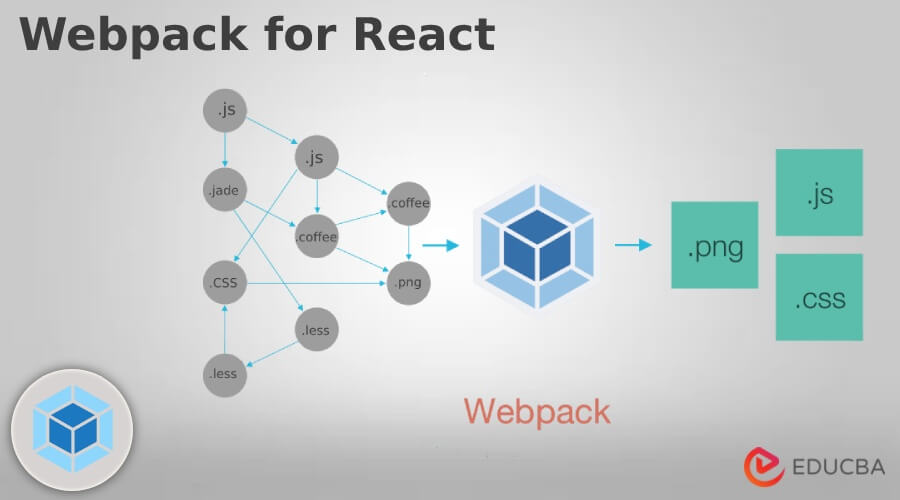
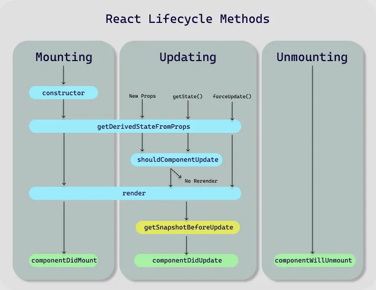

# React 

## History of React

### 📅 Timeline
- **2011**: Initially developed by **Facebook**
- **2013**: Officially released to the public

### 🧱 Architecture
- **Component-Based Architecture**  
  React applications are built using reusable components, making UI development modular and maintainable.

### 🌐 Language Support
- **JavaScript**
- **TypeScript**

### 🔧 Key Features
- Declarative UI
- Virtual DOM for performance optimization
- Unidirectional data flow
- JSX (JavaScript XML) syntax
- Strong community and ecosystem 


# React Overview 
React  
├── Developed: 2011  
|   |   |--jorden walke
│   └── By: Facebook  
├── Architecture: Component-Based  
├── Language Support  
│   ├── JavaScript  
│   └── TypeScript  
├── Public Release: 2013  
│   └── Launched to Market  


# angular Overview

Angular  
├── Developed: 2010  
│   └── By: Google  
├── Architecture: Component-Based  
├── Language Support  
│   ├── TypeScript (Primary)  
│   └── JavaScript  
├── Public Release: 2016 (Angular 2+)  
│   └── Note: AngularJS (v1) was released in 2010  


# Vue.js Overview

Vue  
├── Developed: 2014  
│   └── By: Evan You  
├── Architecture: Component-Based  
├── Language Support  
│   ├── JavaScript  
│   └── TypeScript (Optional Support)  
├── Public Release: 2014  
│   └── Launched as Progressive Framework  

# ract Engine(react fiber)

#### react fiber
- is the react engine that handle all the internal working of react like dipping algoritham , Reconciliation and lot many things

### dipping Algoritham
process of finding changes between real DOM and Virtual DOM is called dipping Algoritham  --> (process done) react DOM library


copy of virtual dom --> virtual dom         
- it is the Process of impliment changes between copy of virtual dom to virtual dom  ->  is know as dipping algorithm

### Reconciliation
- it is the Process of impliment changes between virtual dom to real dom  ->  is know as Reconciliation

### 📚 Difference Between Frameworks and Libraries in JavaScript

| Aspect                   | **Library**                                                     | **Framework**                                                  |
| ------------------------ | --------------------------------------------------------------- | -------------------------------------------------------------- |
| **Control**              | *You call the library functions.* You are in control.           | *Framework calls your code.* It controls the application flow. |
| **Inversion of Control** | ❌ No — You decide when and how to use it.                       | ✅ Yes — It decides when and how to use your code.              |
| **Purpose**              | Provides specific functionality (e.g., DOM manipulation, HTTP). | Provides a full structure to build SPA/MPA applications.       |
| **Flexibility**          | More flexible — Use only what you need.                         | Less flexible — Must follow the framework's conventions.       |
| **Examples (JS)**        | `jQuery`, `Lodash`, `Axios`, `Chart.js`, `React`                | `Angular`, `Vue`, `Next.js`, `Nuxt.js`, `SvelteKit`            |
| **Learning Curve**       | Usually easier to learn and plug into projects.                 | Higher — requires learning lifecycle, routing, CLI, etc.       |
| **Maintenance**          | Easier — fewer side effects, smaller scope.                     | Harder — tightly coupled components can cause side effects.    |
| **Real-World Role**      | Helps in **doing** something.                                   | Helps in **building** the whole app architecture.              |


 ### single page application

- application dosent required page reloade on any action they kept in single html application.

*** Advantages ***

- Application become more faster (fast rendering)
- reduce the line of code 


# AJAX
- stands for Asyncronus javascript and xml  
- AJAX allows webapplications to send and recive only the necessory requests ans responses from server without reloading the entire page 

# package bundler (rollup)
 - package bundler inreact is the tool that collects all your projects files(js,css,img,etc) , resolve dependacies and bundle them into few optimized files for the browser and server to load
        


## bandwidth 
- it is request response cycle per seconds

# webpack
- they rduces the bandwidth


## files

### index.html
- in one react application we can have only one html file you should not change name
- this html file includs only 2 thisngs 
- 1)  ```<div id="root"> </div>```
- 2)  ``` <script type="module" src="./src/main.js"></script>```
>
### node_moduls folder
- it is the folder that hold all the javascript folder(dependencies) required for your project
- eg -rollup,eslint,vite,babel.........

### babel : babel is the transpiler it convert letest javascript(jsx) into browser understandeble code(js)

- example 

```
<div>hello </div>

//it convert bable into

let newDev=createElement('div',null,"hello")
```
### npm vs npx

| Feature              | `npm`                    | `npx`                                    |
| -------------------- | ------------------------ | ---------------------------------------- |
| **Stands for**       | Node Package Manager     | Node Package Executor                    |
| **Main use**         | Install/manage packages  | Execute a package directly               |
| **Installation**     | Yes, installs package    | No installation needed (unless required) |
| **Global pollution** | Can clutter global space | Does **not** install globally            |
| **Use case**         | Managing dependencies    | Running one-time CLI tools               |
| **Example**          | `npm install <package>`  | `npx eslint .`                           |


### 💡 When to use what?
✅ Use **npm** when:

You want to install and reuse a package multiple times.

It's a dependency for your project.

✅ Use **npx** when:

You want to try or run a tool once.

Avoid cluttering your system with global installs.

### Hot Module Replacement (HMR) ( important for interview)
- it is the feature that allows you to update your code without reloading the entire page.
- it is the feature that allows you to update your code without losing the state of your application
- it enables real-time updates modules(javascript,css, etc) without refreshing the whole page.

### assets
- it is the folder that holds all the static assets like images, fonts, etc.


### public
- it is used to store all the static assets but usaly we dont use we use assets folder inside src

### packag.json
- it lists all the basic information about the project like package name default scipts ,versions ,dependencies and devdependencies
package.json  holds all the dependencies-(it holds that files which needed for entire project life cycle) and   
devdependencies(it holds that all files which need for developments)


### packaglick.json
- it represent ll the packages inside node_moduls folders in the form of json file

### gitignore
- git will ignore all the files and folders mention in gitignore file  

### readme.md file
- it represents all the description about the project(Documentions) that is mentationed by developer

### vite.config.js
- it just represet the vite configuratin


## src
   |__assets--> .img/.png.....
   |__App.jsx
   |__App.css
   |__main.jsx
   |__index.css


## rules of JSX
### - JSX must be wrapped in a single parent element.
### - JSX elements must be properly closed.
### - JSX can return only one element at a time.
### - JSX attributes must be written in camelCase.
### - You don't have to pass wrong descendants to any elements.eg div is not allowed inside p tag
### - all JSX elements must be closed, even if they are self-closing.
### - all JSX elements must be in lowercase . only components name should be start with capital letter
### - JSX we have some alternative names for some  attributes like className instead of class, htmlFor instead of for, etc.
### - we can use JSX exprestions for writing js code inside jsx like {1+2} or {name} or {functionName()} etc.
### - JSX can contain comments using curly braces: `{/* comment */}`.
### - we can write only ternery operator as an Conditional statements.
### - we can not write if else statements inside JSX. but we can write in function, 
example 

```
{(){
  if (condition) {
    return <Component />;
  } else {
    return <AnotherComponent />;
  }
}}
```


- we can use only the higher order (Looping statement) that can return anything. eg. map/filter/reduce  etc..  we can use forEach(HOF/looping) but it is not recomended because it can not return anything.
- we can not use for loop inside JSX because it is not a higher order function and it can not return anything.
- we can not use switch case inside JSX because it is not a higher order function and it can not return anything.
- we can not use while loop inside JSX because it is not a higher order function and it can not return anything.
- we can not use try catch inside JSX because it is not a higher order function and it can not return anything.
- we can not use async await inside JSX because it is not a higher order function and it can not return anything.
- we can not use any function that does not return anything inside JSX.
- we can use react fragments to avoid extra node in in DOM tree eg- <React.Fragment> </React.Fragment> or <> </>.
- we can keep empty fragments only when the key Attribute is not required.


## Module
- module is the single javascript or JSX file .
- a js or JSX file will become a module only when we have mentioned type="module" we can achive the import and export between the modules only.
- in react we create modules with .js or .jsx  extentions .
- in one module we can have multiple components.


diffrant between class component and functional component

### Class Component
- we use classes for creating class Base components in react.
- the class extends React.Component. and it has render method means each class base componant must have a render method.
- it hase inbuilt state object and setState method for managing state.
- we dont have any hooks with class base components.
- it have inbult lifecycle method like ComponentDidMount,ComponentWillUnmount,ComponentDidUpdate, etc.
- it is defficult to understand and maintain.


### Functional Component
- we use functions for creating functional base components in react.
- does not extends any Component. and no need to write render method with each component we use render method with main jsx only.
 If you do any Change in a state The whole component will be rendered.
- it does not have inbuilt state object and setState method for managing state.to manage state we have to take help of state manage tools like redux/toolkit or hooks like useState/useReducer.
- we have hooks with functional base components like useState/useEffect/useReducer/useContext/usecallback/peram.
- we dont have any inbuilt lifecycle method but we can achive them using useEffect hook.

 ## use State
- `useState` is a React Hook that allows you to add state to functional components.
- It returns an array with two elements: the current state value and a function to update that state.
- The state is preserved across re-renders, allowing you to manage dynamic data within your component.
- The initial state can be set by passing a value to `useState`.
- it is easy to understand and maintain.


## Pure Component
- A **Pure Component** in React is a component that only re-renders when its props or state actually change.
- It implements a shallow comparison of props  and state in its `shouldComponentUpdate` lifecycle method, preventing unnecessary renders.
- Pure components help optimize performance, especially in large applications.
- In class components, you can extend `React.PureComponent` instead of `React.Component` to make a component pure.
- For functional components, you can use `React.memo` to achieve similar behavior.

**Example (Class Component):**
```jsx
class MyComponent extends React.PureComponent {
  render() {
    return <div>{this.props.value}</div>;
  }
}
```

**Example (Functional Component):**
```jsx
const MyComponent = React.memo(function MyComponent(props) {
  return <div>{props.value}</div>;
});
```
at is used `shouldComponentUpdate` lifecycle method, preventing unnecessary renders. What is used in a hook?
- state is used to manage the data that is specific to the component.
- state is mutable, meaning it can be changed by the component that owns it.

## Hooks 

- it is the inbuilt functions which comes with react.
- it is used to manage state and lifecycle methods in functional components.

## props
- props are the properties that we pass to the components.
- props are used to pass data from parent component to child component.
- props are read-only and cannot be modified by the child component.
- props are used to pass data from one component to another component.
- props are ***immutable***, meaning they cannot be changed by the component that receives them.
- often used to pass data from parent to child components, allowing for dynamic rendering and behavior.
- String, Number, Boolean, Array, Object, Function, and even React elements can be passed as props.

### default props
- default props are the props that are used when the parent component does not pass any props to the child component.
- default props are used to provide default values to the props.
- default props are used to avoid errors when the parent component does not pass any props to the child component.
- default props are used to provide default values to the props.

### prop types
- prop types are used to validate the props passed to a component.
- prop types can be used to specify the type of props a component should receive.
- prop types can help catch errors and improve code quality.


### difference between props and state
| Aspect                 | **Props**                                                | **State**                                                   |
| ---------------------- | -------------------------------------------------------- | ----------------------------------------------------------- |
| **Definition**         | Data passed from parent to child component               | Data managed within the component itself                    |
| **Mutability**         | Immutable (read-only)                                    | Mutable (can be changed using setState)                     |
| **Manage**             | Manage by parent component                               | Manage by the component itself                              |
| **Usage**              | Used to pass data into child components                  | Used to manage local component data and behavior            |
| **Updates**            | Triggered by parent component re-rendering               | Triggered by component's own logic (e.g., user input)       |
| **Lifecycle**          | Props are set once when the component is created         | State can change over time, triggering re-renders           |
| **Example**            | `<ChildComponent propName={value} />`                    | `this.setState({ key: value })` or `useState(initialValue)` |
| **Default Values**     | Can be set using `defaultProps`                          | Can be set using initial state in constructor or `useState` |
| **Validation**         | Can be validated using PropTypes or TypeScript           | Not typically validated, but can be checked in logic        |
| **rerender**           | yes,when parent changes its props, child will rerender   | yes, when state changes, component will rerender            |
| ---------------------- | -------------------------------------------------------- | --------------------------------------------------          |

### props Children
- `props.children` is a special prop in React that allows you to receive and render the elements placed between the opening and closing tags of a component.
- It is used to render nested components or elements within a parent component.
- `props.children` can be any valid React element, including strings, numbers, or other React components.
- It allows for flexible and reusable component structures, enabling you to create components that can accept and render arbitrary content.

```jsx
function ParentComponent(props) {
  return <div>{props.children}</div>;
}

function App() {
  return (
    <ParentComponent>
      <h1>Hello, World!</h1>
      <p>This is a child element.</p>
    </ParentComponent>
  );
}
```


/* bubling,capchering,event deligation ,Event propogation */


### Event Bubbling
- Event bubbling is a mechanism where an event starts from the target element and propagates up to the root of the DOM tree.
- In React, event handlers are attached to the target element, and when the event occurs, it bubbles up through the parent elements.
- This means that if you attach an event handler to a parent element, it will also respond to events triggered by its child elements.
- Example:

```jsx
function ParentComponent() {
  const handleClick = () => {
    console.log("Parent clicked");
  };

  return (
    <div onClick={handleClick}>
      <ChildComponent />
    </div>
  );
}

function ChildComponent() {
  const handleClick = () => {
    console.log("Child clicked");
  };

  return <div onClick={handleClick}>Click me</div>;
}
```
In this example, clicking on the child component will trigger both the child's and parent's click handlers due to event bubbling.


### Event Capturing
- Event capturing is the opposite of bubbling. It starts from the root of the DOM tree and propagates down to the target element.
- In React, event capturing can be enabled by using the `capture` phase in the event handler.
- To enable capturing, you can pass a third argument to the event handler, like this:

```jsx
function ParentComponent() {
  const handleClick = () => {
    console.log("Parent clicked");
  };
  return (
    <div onClickCapture={handleClick}>
      <ChildComponent />
    </div>
  );
}

function ChildComponent() {
  const handleClick = () => {
    console.log("Child clicked");
  };

  return <div onClickCapture={handleClick}>Click me</div>;
}
```
In this example, clicking on the child component will trigger the parent's click handler first due to event capturing, followed by the child's click handler.

synthetic events - is an object which will give you entire info of current object that is being clicked or hovered or any event that is being triggered in react.(target element, type of event, etc..)


## useref Hook
- it is not recomended
- because it is change direct in realDOM it skip interection with virtual DOM So we can say it is uncontrolled component.
-  it also commenly used to access the DOM elements directly.
- the useref hook in react it is way to create a reference to a DOM element or muteble value that dosent triger rerender when it changes.

```jsx
import { useRef } from "react";

const myRef = useRef();
```


-it returns ref object with ref.current property that can be hold DOM element reference or any value.
- the muteble value that can change across the renders without causing a re-render of the component.
- useref hook converts your controlled components into uncontrolled components, because insted of interacting with the virtual DOM, it directly interacts with the real DOM.


| Aspect                 | Details                                                                                                                   |
| ---------------------- | ------------------------------------------------------------------------------------------------------------------------- |
| **Usage**              | Stores a mutable value or references a DOM element.                                                                       |
| **How to use**         | `const ref = useRef(initialValue)`                                                                                        |
| **Access**             | `ref.current` (read/write the current value)                                                                              |
| **Triggers Re-render** | ❌ No (does **not** cause re-render like `useState`)                                                                       |
| **Props**              | Not passed via props – it's used locally inside a component                                                               |
| **Changes**            | Updating `ref.current` **does not** re-render the component                                                               |
| **Cons**               | - Not reactive (no auto UI updates)<br>- Easy to misuse like a global var                                                 |
| **Best Use Cases**     | ✅ Accessing DOM nodes <br> ✅ Storing timers/intervals <br> ✅ Tracking previous state <br> ✅ Avoiding re-rendered counters |


example of useRef
```jsx
import React, { useRef } from "react";

function MyComponent() {
  const inputRef = useRef();

  const focusInput = () => {
    inputRef.current.focus();
  };

  return (
    <div>
      <input ref={inputRef} type="text" />
      <button onClick={focusInput}>Focus Input</button>
    </div>
  );
}

export default MyComponent;
```

#### focus
- The `focus()` method is used to set the focus on a specific DOM element, such as an input field. In React, you can use the `useRef` hook to create a reference to the input element and then call `focus()` on that reference when needed.
- This is particularly useful for automatically focusing an input field when a component mounts or when a specific action occurs, such as clicking a button.


```jsx
import React, { useRef, useEffect } from "react"; 

function AutofocusInput() {
  const inputRef = useRef();

  useEffect(() => {
    inputRef.current.focus();
  }, []);

  return <input ref={inputRef} type="text" />;
}

export default AutofocusInput;
```


## Context API


## Life cycle Methods (imp)

- lify cycle method availabele with class base componants
- we can achive the lifecycle methods in function base componanat using useEffectHook
-lifecycles method available in three diffrant pages that is 
- 1. mounting phase
- 2. updating phase
- 3.  unmounting phase




## Mounting Phase 
- mounting phase start when page lode first time
- there are some mothods in mounting phase

### Constructor()
- it loads only onse so that it becomes the best place to inintialize the veriables and binding this keyword
- it is an obtional method in which you must use supercall statement
- 

### getDrivedStateFromProps()
- this method can exicute again and again
- during mountinting phase it gets invoke the constructor and befour the render method
- in that method we can update the state on the the basis of props also.
- this is not mendetory method(optional)

### render

- this method get invoke again and again
- this is the mandetory method
- this method is responsible to ddiplace content on the ui.

### ComponantDidMount()
- this method execute only once at the end of mounting phase.
- useully we perform the syncronus task and network releted operatins-> (get ,post,put,patch)
- this method excecute last because first all the content shound be render on the ui using render method  than this method can perform the time consumming tasks as per its own.


## Updating Phase

- this phase start when users start taking any actions or interactions

### getDerivedStateFromProps()
- As previes from mountinhg phase

### ShouldComponantUpdate()
- this method will check weither the componant should be updated or not.
- is this method returns tru then only remaining method in update Phase will be executed.
- if false no remaining mehod excecuted from updateding phase.
- and it will be decided on the basis of changes into the state.

### render()
- As previes from mountinhg phase

### getSnapShotBefourUpdate()
- this method keep the record of the previews state so if requird we can use it also.
### ComponantDidUpdate()
- this method is almost semiler to componantDidMountAnd the diffrance is this method excecuts repitetly on each state update.

-in Updating phase each method can be revoke(call) repetetly on state update.

## UnmountingPhase
- this phase occurse when we are about to leave the componants.
-this phase hase only one method Componatwillunmount.


### Componatwillunmount()
- this method stop the unessesory excecition(backghround activitys) when we are leving the componant.
- this method exicute only ones thowout the lifecycle.


## UseEffectHook

- this Hook use to achive lifecycle methods in functionbase componants.
- using this hook we can achive 3 lifecycle methods.
 ***syntax***
``` 
const UseEffectHook = () => {
  useEffect(() => {
    // ComponentDidMount logic
    return () => {
      // ComponentWillUnmount logic
    };
  }, []);
};

```

- we can pass n no. of dependencies in dependency array
- whenever any single depency changes the callback function get call/excecuted.

## how to achive ComponantDidMount() using UseEffect
```
UseEffect(()=>{},[])
```

- it is similer to ComponantDidMount min the Currect callback fun can not be revoke/call back any situation
- we can use this method to call the apis and get the data innitialy.

## how to achive componantDidUpdate using UseEffect

```
useEffect(()=>{},[dependacy1,dependacy2,dependacy3])
```

- now the currenct callback function call based on the dependacycs
in above example we have 3 depencys.
- if any of the dependacy change callback fun woll get call
- mostly the dependencys will be the states only.

## how to achive ComponantWillUnmount using UseEffect

- syntax
```
useEffect(() => {
let timer=setTimer(()=>{
  Console.log("tik tik");
},1000)

return () => {
  clearTimeout(timer);
};
}, []);

```
- to Achive ComponantWillUnmount we have must return the Function which will clear the uneccery background excecutions


## Redux

Redux toolkit is cetralie state managment tool
- Redux toolkit offers shorter syntax for managing the state
- compare with the previews redux version,
- it consists of two imp things slice and store.


## slice

- slice offers you the place to define and manage the state with the help of reducer functions .
- we can create multiple slices and even multiple reducer functions inside each slice.

- syntax of slice

```javascript
import { createSlice } from "@reduxjs/toolkit";

const initialState = {
  value: 0,
};
const counterSlice = createSlice({
  name: "counter",
  initialState,
  reducers: {
    increment: (state) => {
      state.value += 1;
    },
    decrement: (state) => {
      state.value -= 1;
    },
  },
});

export const { increment, decrement } = counterSlice.actions;
export default counterSlice.reducer;
```


- all the reducer functions and extra reducers gets the defaults arguments of current state and action object.

#### state 
- it is the current state which we will use inside the reducer function, based on it we will create new state object nad we have to return the newely created state from the reducer function

#### Store
- store holds all the informatopn about multiple available slices and reducer functions.
- Componant will dispatch an action , the action will come in to the store , will be forworde it to respective slice, in that slice reducer will be called based on the action,it can also use the payload into an action object.
- reducer will update the state, updated state will be given to the store and updated  state will be availabel  into the componant with the help of selectors hooks.


## with selectors
- it is use to access the current state.
- syntax of selectors

```javascript
import { useSelector } from "react-redux";
const currentState = useSelector((state) => state.counter.value);

```
- it bevaivs as an geter method 
- 
### useSelector Hook
-  is an higher order function  which take another function as an arguments and passes the acess of current state as an argument to the callback function.


### useDispatch hook
- it is the hook use for dispatching the actions from any of the componant.

- syntax
- 
```
let dispatch= useDispatch() 
```

- on clicking any button we will dispatch any action and we can pass payload while dispatching the action.
- syntax
```
<button onClick={(e) => dispatch(increment(state))}>Increment</button>
```

- useDispatch can use as a seter method to update the state.


- to have the access of state in throwout the application we have to make /provide  created store to entire application using Provider in main.jsx file(not compalsary in main.jsx).
  
```javascript
  import { Provider } from "react-redux";
  import store from "./store";
  <Provider store={store}>
    <App />   
  </Provider>,
```